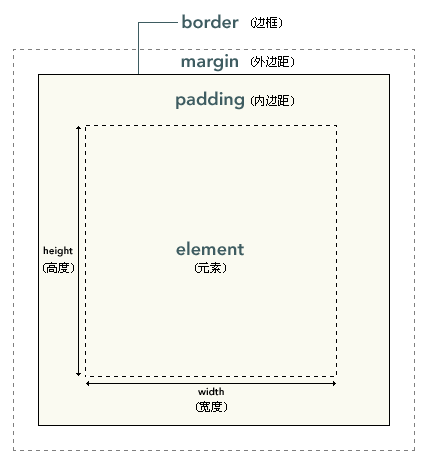

# CASCADING STYLE SHEET (CSS, 层叠样式表)

## 页面CSS的来源
> 1. 外部文件，通过在\<head>\</head>里使用 \<link rel="stylesheet" href="">引入
> 2. 内部，\<head>\</head>里使用\<style type="text/css">\</style>定义
> 3. 行内，在元素的style属性里定义

### 外部和内部语法格式
```css
selector { property: value; }

/*This is a comment 这是注释*/

selector {
    property1: value1;
    property2: value2;
    property3: value3;
}

```

### 行内语法格式
```html
<element style="property: value;"></element>
```

## 选择器 (selector)
> 1. 元素选择器 (Element type selector)
> 2. ID和类选择器 (ID and class selectors)
> 3. ...

### 元素选择器 (Element type selector)
```css
body { font-family: "宋体"; }

```

### ID和类选择器 (ID and class selectors)
```css
/*ID selector*/
#id { font-family: "宋体"; }

/*Class selector*/
.class { font-family: "宋体"; }
```

## 常用样式
```css
/* css大部分情况下会使用2种单位,一是px像素,一是em, 默认情况下1em=16px */
div { width: 200px; width: 200em; } /* 宽度 */
div { min-width: 200px; } /* 最小宽度 */
div { max-width: 200px; } /* 最大宽度 */

div { height: 200px; } /* 高度 */
div { min-height: 200px; } /* 最小高度 */
div { max-height: 200px; } /* 最大高度 */

div { font-family: "icomoon", fantasy, ; } /* 字体 */
div { font-size: 22px; } /* 字体大小 */
div { font-weight: bold; } /* 字体粗细 */
div { font-style: italic; } /* 字体风格，比如斜体 */
div { font-variant: small-caps; } /* 字体变体, small-caps表示小写字母大写显示， 不常用 */
div { font-stretch: wider; } /* 字体伸缩， 不常用 */
div { font: 22px; } /* 字体总属性，{ font: style weight stretch variant size/line-height font-family; } */

div { color: red; } /* 字体颜色 */

div { background-color: red; } /* 背景颜色 */
div { background-image: url('URL'); } /* 背景图片 */
div { background: red; } /* 背景总属性 */

div { text-align: center; } /* 文字排列方式: center, left, right */

div { border-width: 10px; } /* 边框宽度 */
div { border-style: dotted; } /* 边框样式,比如dotted表示虚线 */
div { border: 10px; } /* 边框总属性,顺序为width, style, color { border:5px solid red; } */
div { border-top: 10px; } /* 上边框总属性 */
div { border-right: 10px; } /* 右边框总属性 */
div { border-left: 10px; } /* 左边框总属性 */
div { border-bottom: 10px; } /* 下边框总属性 */

div { border-radius: 10px; } /* 边角总属性 */
div { border-top-left-radius: 10px; } /* 左上边角总属性 */
div { border-top-right-radius: 10px; } /* 右上边角总属性 */
div { border-bottom-right-radius: 10px; } /* 右下边角总属性 */
div { border-bottom-left-radius: 10px; } /* 左下边角总属性 */

div { margin-top: 5px; } /* 上外边距 */
div { margin-right: 5px; } /* 右外边距 */
div { margin-left: 5px; } /* 左外边距 */
div { margin-bottom: 5px; } /* 下外边距 */
div { margin: 5px 10px 5px 10px; } /* 外边距总属性,顺序为上,右,下,左 */

div { padding-top: 5px; } /* 上内边距 */
div { padding-right: 5px; } /* 右内边距 */
div { padding-left: 5px; } /* 左内边距 */
div { padding-bottom: 5px; } /* 下内边距 */
div { padding: 5px 10px 5px 10px; } /* 内边距总属性,顺序为上,右,下,左 */

```
关于边框,边距  
> 